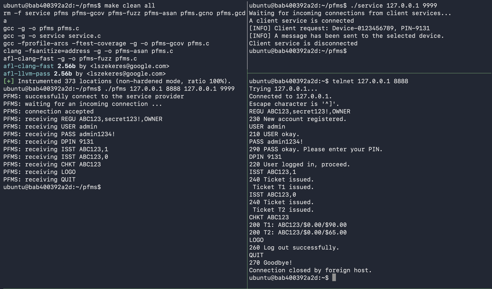

# SWEN90006 Assignment 2: Fuzzing PFMS with Multi-Factor Authentication (MFA) support

## Overview

PFMS simulates a Parking Fine Management System (PFMS) -- the same
system you tested in Assignment 1 -- in which vehicle owners and council
administrators connect to a PFMS server to register accounts, check
and pay outstanding parking fines, and (for admins) issue new fines. The
owners are categorized as regular vehicle owner accounts (OWNER)
who may optionally enable multi-factor authentication (MFA) for their own
account. There is one special account type, ADMIN, for which MFA
is compulsory and which alone can issue new tickets.

This assignment deals with security testing of the PFMS server using
the code coverage-guided grey-box fuzzing technique (covered by Chapter 9
in the lecture notes). Since PFMS is a stateful system (i.e., its
behaviour depends not only on the current request message, which is sent
from a client, but also on its current state controlled by previous
sequence of messages), you are recommended to use
[AFLNet - A Greybox Fuzzer for Network Protocols](https://github.com/aflnet/aflnet)
instead of the [vanilla AFL fuzzer](https://github.com/google/AFL). You
are expected to read the
[AFLNet ICST'20 paper](https://thuanpv.github.io/publications/AFLNet_ICST20.pdf),
watch [this presentation video](https://www.youtube.com/watch?v=Au3eO7mEI7E&t=2s),
and read the
[AFLNet README document](https://github.com/aflnet/aflnet/blob/master/README.md)
to understand the key concepts of stateful fuzzing for network protocol
implementations before starting this assignment.

The PFMS server is implemented in C and it supports a simple
multi-factor authentication (MFA) mechanism. More details are provided in
"The System: PFMS" section.

**Relationship to Assignment 1:** the underlying business rules --
registration formats, the single active-session model, ticket lifecycle,
and payment rules -- are the same ones specified in `PFMSSpec.txt`
from Assignment 1.

The aim of this assignment is to systematically fuzz test the PFMS
server to discover security vulnerabilities. Note that in the context of
this assignment, we only consider the following types of faults as
security vulnerabilities.

1. Any fault that causes PFMS-net to crash or hang leading to a
   denial-of-service attack (e.g., Null pointer dereference
   ([CWE-476](https://cwe.mitre.org/data/definitions/476.html))).
2. Critical memory faults such as Stack/Heap Buffer Overflow
   ([CWE-121](https://cwe.mitre.org/data/definitions/121.html) and
   [CWE-122](https://cwe.mitre.org/data/definitions/122.html)), Use-After-Free,
   and Double Free
   ([CWE-416](https://cwe.mitre.org/data/definitions/416.html) /
   [CWE-415](https://cwe.mitre.org/data/definitions/415.html)).
3. Logic/functional faults that would allow attackers to gain
   unauthorized access or obtain data they are not entitled to (e.g.,
   [CWE-285](https://cwe.mitre.org/data/definitions/285.html),
   [CWE-200](https://cwe.mitre.org/data/definitions/200.html)).
4. Logic/functional faults that would allow attackers to steal users'
   information or compromise the integrity of users' data.
5. Logic/functional faults that would allow attackers to cause financial
   loss to the owner of the PFMS service (the council).

It means that memory leaks and "benign" integer overflows (i.e., integer
overflows that do not lead to more critical issues such as program
crashes) are not counted. Having said that, please discuss with us your
findings and report them in your final reports if you are in any doubt.

## The System: PFMS Parking Fine Management Service

<p align="center">
  
</p>

PFMS simulates a council parking fine service and includes functions
for registering accounts, checking and paying outstanding fines, and
issuing new ones. In this assignment, we focus on testing this server. It
has the following main intended features:

1. To maintain a list of accounts including a default administrator
   account (username: "admin", password: "admin1234!", MFA device id:
   "0123456789"). For simplicity, all passwords are not encrypted. MFA is
   **compulsory** for every ADMIN account.
2. To register new accounts using the REGU command -- either a
   an OWNER account (identified by a plate number) or an ADMIN
   account (identified by an admin-chosen name; must supply a valid
   10-digit MFA device id at registration).
3. To allow users update their password (UPDP) and add/replace their
   device id (AMFA, i.e. a valid 10-digit mobile phone number) to enable
   MFA if they wish. MFA is **opt-in** for OWNER accounts: an owner may
   enable it either at registration time or later via AMFA, but is never
   required to.
4. To check outstanding tickets for a plate number using the CHKT
   command.
5. To issue a new ticket against a plate number using the ISST command
   (admin only).
6. To pay an outstanding ticket using the PAYT command. Unlike most other commands, PAYT does not require login, in accordance with the Assignment 1 specification. This simplifies the implementation of the PFMS server and is therefore not considered a vulnerability in this assignment.


Detailed description of the functions of the PFMS server and its
implementation can be found in the file `pfms/pfms.c`. When the server is
started, it first tries to connect to a simulated telecommunication
company service (i.e., telco service as implemented in the file
`pfms/service.c`). Through this service, PFMS implements the MFA
mechanism: PFMS generates the PIN itself and asks the telco service
to "deliver" it to the registered device; the telco service does not
generate or send anything back. Once the PFMS server-telco service
connection is established, PFMS starts another network channel and
waits for connection requests from users. A user can send
requests/commands with arguments/parameters to log in to the server,
change password, add/replace their phone number (i.e., the device id in
this implementation), check outstanding tickets, pay tickets, and (for
admins) issue tickets. Specifically, PFMS supports 11 commands: USER
& PASS (for weak authentication) & DPIN (for stronger authentication with
MFA), REGU (register a new account), AMFA (add/replace a device to
enable/replace MFA), UPDP (update user password), CHKT (check outstanding
tickets), ISST (issue a ticket), PAYT (pay a ticket), LOGO (log out of
the current account), and QUIT (terminate a connection). Note that if MFA
is enabled and the correct PIN is not provided after three attempts, the
user needs to restart the authentication process. That is, they need to
provide username and password again. For simplicity, PFMS does not
support concurrent connections and once a connection is terminated (e.g.,
by the QUIT command), the PFMS server is stopped too. However, in one
connection, users can log in and out with different accounts.

### Protocol quick reference

All server responses follow the same structure: they
start with a 3-digit response code, followed by a space and a
descriptive message, and end with CR and LF characters (`\r\n`).

| Command | Arguments (comma-separated where more than one) | Notes |
|---|---|---|
| `USER` | `<username>` | |
| `PASS` | `<password>` | |
| `DPIN` | `<pin>` | only if MFA is enabled for the account |
| `UPDP` | `<newpassword>,<newpassword>` | must be logged in |
| `REGU` | `<username>,<password>,<ROLE>[,<deviceId>]` | `ROLE` = `OWNER` or `ADMIN`; `deviceId` required for `ADMIN`, optional for `OWNER` |
| `AMFA` | `<deviceId>` | must be logged in; opts in / replaces device |
| `CHKT` | `<plateNumber>` | must be logged in |
| `ISST` | `<plateNumber>,<fineType>` | admin only; `fineType` = `0`-`3` |
| `PAYT` | `<plateNumber>,<ticketID>,<amount>` | no login required |
| `LOGO` | (none) | |
| `QUIT` | (none) | |

`fineType` indices, matching `FineType` in `PFMSSpec.txt` in the Assignment 1:
`0 = OVERSTAYED_PARKING ($65.00)`, `1 = NO_STANDING_ZONE ($90.00)`,
`2 = EXPIRED_METER ($55.00)`, `3 = DISABLED_PARKING_MISUSE ($300.00)`.

### Building and running the program

The assignment comes with a Dockerfile to ease your setup. To build a
"ready-to-fuzz" Docker image, you just need to run the "docker build"
command. Specifically, the following command will build a Docker image
named "swen90006-assignment2" on computers using Intel processors.

```bash
docker build . -t swen90006-assignment2
```

For computers running Apple M1-M5 processors, please use the following command instead.

```bash
docker build --platform=linux/amd64 . -t swen90006-assignment2
```

Once the Docker image is successfully built, you can start a Docker
container.

```bash
docker run -it swen90006-assignment2
```

The source code of the PFMS server is stored inside the
`/home/ubuntu/pfms` folder in the Docker container. To compile it and the
telco service (service.c), you just need to run the following commands.

```bash
cd $WORKDIR/pfms
make all
```

The "make all" command compiles PFMS server & telco service and
produces five different binaries: 1) the telco service (named service),
2) a normal PFMS server binary (named pfms), 3) an instrumented
binary for fuzzing with AFLNet (named pfms-fuzz), 4) a binary to collect
code coverage using [gcovr](https://gcovr.com/en/stable/guide.html)
(named pfms-gcov), 5) a binary built with
[Address Sanitizer](https://releases.llvm.org/6.0.1/tools/clang/docs/AddressSanitizer.html)
(named pfms-asan) that helps you capture some non-crashing errors (e.g.,
Heap Buffer Overflow, Use-After-Free, Double Free).

If you make changes to pfms.c (e.g., adding assertions to capture logic
bugs), you can delete existing binaries and recompile the program by
running the following command.

```bash
cd $WORKDIR/pfms
make clean all
```

The following screenshot shows a sample execution of the normal PFMS server (binary name: `pfms`). We use [tmux](https://github.com/tmux/tmux/wiki) to divide the screen into three parts, called panes, to illustrate how the three components communicate with each other. In the left pane, the PFMS server is running on the localhost (IP address: `127.0.0.1`) and listening on port `8888`. Before starting the server, it connects to the telco service, which also runs on the localhost on port `9999` (top-right pane). In the bottom-right pane, a client, using [telnet](https://www.acronis.com/en-sg/articles/telnet/) in this example, connects to and communicates with the PFMS server to simulate a user device (e.g., a smartphone). Once the connection is established, the user can send requests or commands to the server. For each successful request, the client receives a response from the server. Note that `\r\n` represents the CR and LF characters in the [ASCII table](https://www.asciitable.com/). These are control characters commonly used to indicate the end of a line. All server responses follow the same structure: they start with a response code, followed by a space character and a descriptive message, and end with CR and LF characters.



## Your tasks

In this assignment, you are expected to complete the following tasks. In Tasks 1, 2 and 3, you are allowed to use generative AI (e.g., LLMs). However, you cannot use AI to write the report for Task 4. You may use generative AI for grammar correction in your report. If you use AI, you must document how you used it and reflect on where AI is helpful, where it can fully complete the work, and where human insights are important.

### Task-0: Complete group_info.txt and GroupAgreement.docx

Modify the file group_info.txt by placing your group number followed by
group members' names, student IDs and email addresses. This is so we can
match your repository with your group for marking.

Moreover, you will need to discuss with the other members of your group and complete a group agreement document using the provided template (`GroupAgreement.docx`). We will use this document, the history of changes on GitHub, and the final report to assess the contribution of each team member.

### Task-1: Prepare a fuzzing setup to fuzz the PFMS server

Follow the instructions in the AFLNet repository to prepare a fuzzing setup for fuzzing the PFMS server using the PFMS protocol. Note that the AFLNet source code provided in this repository already supports the PFMS protocol, which follows the response-code / CRLF-terminated protocol format used by PFMS and popular protocols such as FTP and SMTP. Therefore, you do not need to make any changes to files such as `aflnet/aflnet.h` and `aflnet/aflnet.c`. However, you are free to modify AFLNet (e.g., its mutation operators) if you believe these changes could improve fuzzing performance.

### Task-2: Achieve high code coverage

Run and continuously improve the fuzzing setup to achieve high code
coverage. For instance, you might want to improve the quality of the seed
corpus or add a fuzzing dictionary (i.e., a collection of keywords or special values that can be inserted into the selected seed input by AFLNet).

To measure how much code coverage your experiments have achieved, given a
set of test inputs generated in your experiments, you should run those
inputs with the pfms-gcov binary so that the code coverage information
can be collected (see https://gcovr.com/en/stable/guide.html).

### Task-3: Discover vulnerabilities

The given PFMS server has **three** known security vulnerabilities.
You are expected to discover all of them and write detailed explanations
about what the vulnerabilities are, their potential impacts and how to reproduce
them to get full marks for this task. Since this assignment focuses on
fuzzing, you should document all the instructions to find those
vulnerabilities through fuzzing. The markers may follow the instructions
to confirm your findings.

### Task-4: Write report & reflections

Write a group report documenting all your steps, from the initial fuzzing setup to the improvements you made to achieve high code coverage and discover more vulnerabilities. You are also expected to reflect on your experiments, including what worked well and what did not work, specifically discussing: (a) how the MFA step affected fuzzing progress; and (b) which vulnerabilities were easiest or hardest to find through fuzzing, and why. You may also discuss the advantages and limitations of the selected fuzzer (AFLNet) and suggest potential improvements based on what you have learned in the subject.

### Task-5: Submit experimental artefacts

Submit all the artefacts to the `results` folder by following the
instructions written in `results/README.md`.

## Marking criteria (draft)

| Criterion  | Description  | Marks  |
|---|---|---|
| Workable fuzzing setup | Clear instructions for markers to successfully rerun your fuzzing experiments if necessary.  | 5 |
| Code coverage achieved | Adequate code coverage, including both line coverage and branch coverage, as reported by [gcovr](https://gcovr.com/en/stable/guide.html). You will get zero marks for this part if your achieved line coverage and branch coverage are less than 75% and 55%, respectively. | 5 |
| Vulnerabilitis discovered | You are expected to discover three vulnerabilites to get full marks for this criteria. Your three vulnerabilities might or might not be the same as the three intentionally created ones. You could get bonus marks (1.5 marks for each vulnerability) if you find more than three vulnerabilities. However, the total mark for this assignment cannot exceed 25. | 9 |
| Final report & reflections | Clear demonstration of understanding of the topics used in the assignment, presented in a logical manner.  | 6 |
| **Total** | | 25 |

## Submission instructions

Some important instructions:

1. Do NOT change the main logic (e.g., control flow and data flow) of
   the PFMS server. You are allowed to add assertions to capture
   non-crashing failures (a.k.a logic bugs) though and make small changes
   to control the randomness introduced by the MFA implementation.
2. Do NOT change the directory structure.

### Report submission

Your submission has two parts: 1) your group's copy of this repository, and 2) a PDF final
report (only one group report is required).

## Tips

Some tips to managing the assignment:

1. Ensure that you understand the notes *before* diving into the
   assignment.

2. Ensure that you understand how AFLNet works before starting the
   assignment.

3. Note that fuzzing does not like non-deterministic behaviors of the
   system under test (e.g., the MFA authentication) :).


### Extensions and Special Consideration

Please refer to the **FEIT Extensions and Special Consideration** page on the
subject Canvas site. We do not accept late submissions.

### Academic Misconduct

The University academic integrity policy applies. Students are encouraged to discuss the assignment topic, but all submitted work must reflect the group's understanding of the topic.

